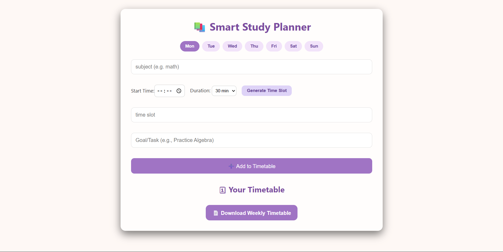

# Smart Study Planner

A simple and interactive **study timetable planner** that helps students organize their study schedule efficiently.

## 🚀 Live Demo

🔗https://responsive-food-website16.netlify.app/

## 📸 Project Screenshot

## ✨ Features

- Create weekly study timetable
- Select day (Mon – Sun)
- Generate automatic time slots
- Add subject and study goals
- Mark tasks as completed
- Download weekly timetable as **PDF**

## 🛠️ Built With

- HTML
- CSS
- JavaScript
- html2pdf.js
- jsPDF

## 👨‍💻 Author

Aditya Kumar Sharma
